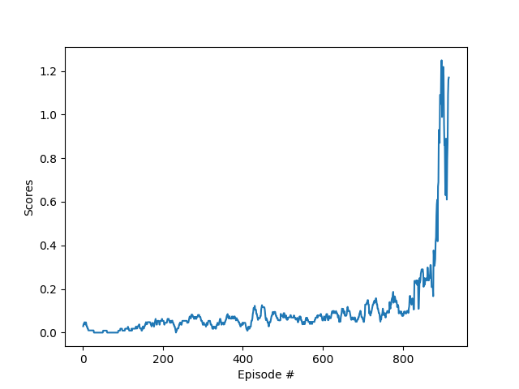

# Tennis with reiforcement learning

 

In this project, the goal is to solve the [Tennis](https://github.com/Unity-Technologies/ml-agents/blob/master/docs/Learning-Environment-Examples.md#tennis) environment.

### The environment

In this environment, two agents control rackets to bounce a ball over a net. If an agent hits the ball over the net, it 
receives a reward of +0.1. If an agent lets a ball hit the ground or hits the ball out of bounds, it receives a reward 
of -0.01. Thus, the goal of each agent is to keep the ball in play.

The observation space consists of 8 variables corresponding to the position and velocity of the ball and racket. Each 
agent receives its own, local observation. Two continuous actions are available, corresponding to movement toward 
(or away from) the net, and jumping. The action space consist of two continous variabels.

The task is episodic, and in order to solve the environment, the agents get an average score of +0.5 
(over 100 consecutive episodes, after taking the maximum over both agents). Specifically,

After each episode, we add up the rewards that each agent received (without discounting), to get a score for each agent. 
This yields 2 (potentially different) scores. We then take the maximum of these 2 scores.
This yields a single score for each episode.
The environment is considered solved, when the average (over 100 episodes) of those scores is at least +0.5.

### Environment Setup

For this project, you can download it, [here](https://s3-us-west-1.amazonaws.com/udacity-drlnd/P3/Tennis/Tennis_Linux.zip) 
from one of the links below. 

Then, place the file in the Tennis/ folder and unzip (or decompress) the file. Open the main.py file and adjust the path 
of the Tennis environment to the correct one:

`env = UnityEnvironment(file_name="./Reacher_Linux/Reacher.x86_64", no_graphics=True)`

For this project, you are encouraged to use a virtual env. You can set it using anaconda: 
`$ conda create drlnd-env` and, then, activate it: `$ conda activate drlnd-env`. 

Finally, you can install the requirements for this project by running `$ pip install -r requirements.txt`
After the instaltion is finished, run the main.py file by `$ python main.py` and observe the train model running

For the traing realized int this project the result can be observed at the graph bellow.

